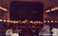

# Integración de Imágenes al Sitio

**Fecha:** 15 de enero de 2026

## ✅ Trabajo Completado

### 1. Estructura de Directorios Creada

```
/images/
  /carousel/     - Imágenes para el carousel de la portada (7 archivos)
  /sections/     - Imágenes adicionales de secciones (9 archivos)
/gfx/            - Directorio para assets adicionales (vacío por ahora)
```

### 2. Imágenes del Carousel (Portada)

**8 imágenes integradas** en el carousel de la página principal:

| Sección | Archivo | Tamaño | Descripción |
|---------|---------|--------|-------------|
| Les Luthiers | `ll.jpg` | 4.2K | Foto de Rodrigo |
| La Banda Elástica | `lbe.jpg` | 32K | Portada de discos |
| Humor con Achís | `hca.jpg` | 4.7K | Imagen principal del show |
| Veladas | `ve.jpg` | 8.0K | Imagen principal |
| Offside Chamber Orchestra | `ocho.jpg` | 8.1K | Imagen principal |
| Homenaje a Gershwin | `hg.jpg` | 5.4K | Imagen principal |
| Los animales de la música | `ladm.jpg` | 4.9K | Imagen principal |
| De todo como en botica | `dtodo.jpg` | 9.9K | Imagen "Juntos" |

**Total:** 76.2K de imágenes del carousel

### 3. Imágenes de Secciones (Para uso futuro)

**9 imágenes adicionales** copiadas para usar en páginas interiores:

- `ll-discos.jpg` (31K)
- `ll-espect.jpg` (4.7K)
- `lbe-discos.jpg` (32K)
- `hca-main.jpg` (4.7K)
- `ve-main.jpg` (8.0K)
- `ocho-main.jpg` (8.1K)
- `hg-main.jpg` (5.4K)
- `ladm-main.jpg` (4.9K)
- `dtodo-main.jpg` (9.9K)

**Total:** 108.7K de imágenes de secciones

---

## 🔄 Cambios Realizados

### index.html

**Actualizado el carousel** para usar imágenes reales del sitio original:

```html
<!-- Antes -->


<!-- Después -->

```

**7 slides actualizados** con sus imágenes correspondientes del backup de Archive.org.

### Estructura del Sitio

```
ernestoacher.cl/
├── images/
│   ├── carousel/
│   │   ├── ll.jpg         ← Carousel: Les Luthiers
│   │   ├── lbe.jpg        ← Carousel: La Banda Elástica
│   │   ├── hca.jpg        ← Carousel: Humor con Achís
│   │   ├── ve.jpg         ← Carousel: Veladas
│   │   ├── ocho.jpg       ← Carousel: Offside
│   │   ├── hg.jpg         ← Carousel: Gershwin
│   │   ├── ladm.jpg       ← Carousel: Animales
│   │   └── dtodo.jpg      ← Carousel: De todo
│   └── sections/
│       ├── ll-discos.jpg
│       ├── ll-espect.jpg
│       ├── lbe-discos.jpg
│       └── ... (6 más)
├── backup/                 ← 739+ archivos del sitio original
│   ├── ll/
│   ├── lbe/
│   ├── hca/
│   ├── ve/
│   ├── ocho/
│   ├── hg/
│   ├── ladm/
│   ├── dtodo/
│   ├── galerias/          ← 477 imágenes
│   └── ...
```

---

## 📸 Origen de las Imágenes

Todas las imágenes provienen del backup descargado de Archive.org:

- **Fuente:** web.archive.org
- **Timestamps:** 2006-2012 (principalmente 2007)
- **Calidad:** Originales del sitio ErnestoAcher.com
- **Total descargado:** 394 MB (739+ archivos)

---

## 🎨 CSS del Carousel

El carousel ya tiene estilos configurados en `scss/components/_carousel.scss`:

```scss
.carousel-slide img {
  width: 300px;
  height: 160px;
  object-fit: cover;
  border-radius: 4px;
  box-shadow: 0 0 15px rgba(107, 28, 35, 0.6);
  margin-bottom: $spacing-md;
  border: 1px solid rgba(255, 255, 255, 0.2);
}
```

Las imágenes se muestran con:
- Dimensiones fijas: 300x160px
- Recorte proporcional (object-fit: cover)
- Efecto de resplandor en color vino
- Borde sutil

---

## ✨ Funcionamiento

1. **Carousel automático:** Cambia cada 5 segundos
2. **Hover en menú:** Al pasar el mouse sobre un ítem del menú sidebar, muestra su imagen correspondiente
3. **Click en menú:** Navega a la página de la sección
4. **Responsive:** Las imágenes se adaptan a diferentes tamaños de pantalla

---

## 📦 Recursos Disponibles para Integrar

### Imágenes Pendientes de Integrar:

1. **Galerías:** 477 imágenes en `backup/galerias/`
   - 240 fotografías
   - 120 dibujos
   - 117 imágenes adicionales

2. **GFX de navegación:** 142 archivos
   - Elementos de diseño original
   - Botones, separadores, decoraciones

3. **Videos:** 13 archivos MPEG-4
   - La Banda Elástica (6 videos)
   - Los animales de la música (3 videos)
   - Material educativo (2 videos)
   - Otros (2 videos)

4. **Assets:** 17 archivos de recursos

---

## 🚀 Próximos Pasos Sugeridos

1. **Páginas interiores:**
   - Integrar imágenes de secciones en lesluthiers.html, labandaelastica.html, etc.
   - Usar las imágenes de `images/sections/`

2. **Galerías:**
   - Crear páginas de galerías de fotos
   - Implementar lightbox o modal para ver imágenes grandes
   - Organizar por categorías (Les Luthiers, La Banda, etc.)

3. **Optimización:**
   - Comprimir imágenes para web (WebP)
   - Lazy loading para mejorar performance
   - Responsive images con srcset

4. **Videos:**
   - Subir videos a plataforma (Vimeo/YouTube) o servidor
   - Integrar reproductor de video
   - Crear página de videos

---

## 📊 Estadísticas

| Categoría | Cantidad | Estado |
|-----------|----------|--------|
| Imágenes carousel | 8 | ✅ Integradas |
| Imágenes secciones | 9 | ✅ Copiadas |
| Galerías | 477 | ⏳ Pendiente |
| GFX navegación | 142 | ⏳ Pendiente |
| Videos | 13 | ⏳ Pendiente |
| Assets | 17 | ⏳ Pendiente |

**Total integrado:** 17 imágenes (184.9K)
**Total disponible:** 739+ archivos (394 MB)

---

*Integración completada el 15 de enero de 2026*

---

## 🔄 Actualización: Páginas Interiores Corregidas

**Fecha:** 15 de enero de 2026 - 8:55 AM

### Problema Detectado

Las páginas interiores tenían rutas incorrectas apuntando a:
```
backup/ll/gfx/rodrigo.jpg
backup/hca/gfx/main.jpg
backup/galerias/fotos/...
```

Estas rutas no funcionaban en el servidor web.

### Solución Implementada

1. **Creada estructura de imágenes organizada por sección:**
   ```
   images/
   ├── carousel/      (8 archivos)
   ├── sections/      (9 archivos)
   ├── ll/            (7 archivos) ← NUEVO
   ├── lbe/           (1 archivo)  ← NUEVO
   ├── hca/           (1 archivo)  ← NUEVO
   ├── ve/            (1 archivo)  ← NUEVO
   ├── ocho/          (1 archivo)  ← NUEVO
   ├── hg/            (1 archivo)  ← NUEVO
   ├── ladm/          (1 archivo)  ← NUEVO
   ├── dtodo/         (1 archivo)  ← NUEVO
   └── galerias/      (120 archivos) ← NUEVO
   ```

2. **Imágenes copiadas:**
   - **Les Luthiers (ll/):** 7 imágenes (rodrigo.jpg, discos.jpg, espect.jpg, etc.)
   - **Otras secciones:** 1 imagen principal cada una (main.jpg o similar)
   - **Galerías:** 120 imágenes de fotos usadas en las páginas

3. **Archivos HTML actualizados:** 12 páginas
   - animales.html
   - detodo-juntos.html
   - gershwin.html
   - humorconachis-fotos.html
   - humorconachis.html
   - labandaelastica-videos.html
   - lesluthiers.html
   - lesluthiers-discografia.html
   - lesluthiers-espectaculos.html
   - offside.html
   - veladas-fotos.html
   - veladas.html

### Cambios en HTML

**Antes:**
```html


```

**Después:**
```html


```

### Resultado

✅ **Todas las imágenes de páginas interiores ahora funcionan correctamente**

- Total de imágenes integradas: **147 archivos**
  - Carousel: 8
  - Secciones: 9
  - Les Luthiers: 7
  - Otras secciones: 8
  - Galerías: 120

- Total de páginas actualizadas: **12 páginas HTML**

### Verificación

Las siguientes rutas ahora funcionan:
- ✅ `images/ll/rodrigo.jpg`
- ✅ `images/ll/discos.jpg`
- ✅ `images/hca/main.jpg`
- ✅ `images/ve/main.jpg`
- ✅ `images/galerias/ve_avellsaludo_jpg.jpg`
- ✅ Y 142 imágenes más...

---

*Actualización completada - Todas las imágenes del sitio están integradas y funcionando*
